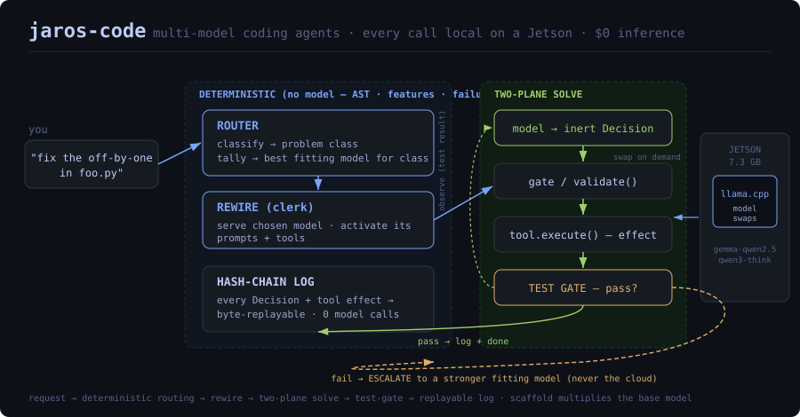

<div align="center">

```
       ┌──────────────────────────────────────────────────────────────┐
       │   ▗▖ ▗▄▖ ▗▄▄▖  ▗▄▖  ▗▄▄▖    ▗▄▄▖ ▗▄▖ ▗▄▄▄ ▗▄▄▄▖              │
       │   ▐▌▐▌ ▐▌▐▌ ▐▌▐▌ ▐▌▐▌      ▐▌   ▐▌ ▐▌▐▌  █▐▌                 │
       │   ▐▌▐▛▀▜▌▐▛▀▚▖▐▌ ▐▌ ▝▀▚▖   ▐▌   ▐▌ ▐▌▐▌  █▐▛▀▀▘              │
       │ ▗▄▟▌▐▌ ▐▌▐▌ ▐▌▝▚▄▞▘▗▄▄▞▘   ▝▚▄▄▖▝▚▄▞▘▐▙▄▄▀▐▙▄▄▖              │
       │                                                              │
       │   Claude-Code-class coding agents on models that fit in     │
       │   your hand — every reasoning call local, on-device, $0.     │
       └──────────────────────────────────────────────────────────────┘
```

**A multi-model coding-agent harness where every reasoning call runs on a small open-weight model
on a Jetson Orin Nano — at zero inference cost, no cloud, ever.**



[The idea](#the-idea) · [Architecture](#architecture) · [The roster](#the-model-roster) · [What it can do](#what-it-can-do-measured-honestly) · [Setup](#setup) · [Usage](#usage) · [Governance](#governance)

</div>

---

## What is this?

`jaros-code` is a terminal coding agent — plan a task, navigate code, fix bugs, build features, run
tests — built to feel like Claude Code, **but every model call is served by a small open-weight
model running entirely on a Jetson Orin Nano (~$250, 7.3 GB) via `llama.cpp`.** No paid API. No
cloud. No data leaving the device. The whole thing runs for **$0 in inference, forever.**

The wager: *small models haven't been useful for serious development because their **harnesses** are
thin — not because the models are incapable.* Make the harness do the heavy lifting — decompose,
verify, route — and a 2–4B model becomes a genuinely useful engineer for a large slice of real work.

> Every reasoning call in this repo cost **$0** and ran on a **2–4B model** on a **Jetson**.
> That's the whole point.

---

## The idea

Frontier agents lean on a frontier model's raw reasoning to drive a free-form loop. A small model
can't carry that. So jaros-code replaces "trust a big model" with four disciplines:

```
  ╔═══════════════════════════════════════════════════════════════════════════╗
  ║  1. TWO-PLANE DISCIPLINE                                                   ║
  ║     The model only emits inert Decision data. A deterministic, test-gated  ║
  ║     execution plane performs every side effect. A wrong generation reverts ║
  ║     — it never ships. The model proposes; the clerk disposes.             ║
  ╟───────────────────────────────────────────────────────────────────────────╢
  ║  2. MULTI-MODEL ROUTING                                                    ║
  ║     No single model. A deterministic router classifies each problem and    ║
  ║     routes it to the on-device model measured-best for that class — then    ║
  ║     the harness rewires itself to that model (loads it, activates its       ║
  ║     prompts/tools). Cheap models first; escalate to a stronger one on a    ║
  ║     test failure — never to the cloud.                                     ║
  ╟───────────────────────────────────────────────────────────────────────────╢
  ║  3. SCAFFOLD IS A MULTIPLIER, NOT AN ADDER                                 ║
  ║     Decomposition, retrieval, repair loops don't *add* capability — they    ║
  ║     *multiply* what the base model has. On a class a model can't touch,     ║
  ║     a scaffold multiplies zero. So: give the multiplier a capable base.    ║
  ╟───────────────────────────────────────────────────────────────────────────╢
  ║  4. HONEST MEASUREMENT                                                     ║
  ║     Every run is hash-chain logged and byte-replayable. A failing test is   ║
  ║     reported failing; a timeout is a harness limit, not a model "0". A      ║
  ║     dishonest 100% is worse than an honest 58%.                            ║
  ╚═══════════════════════════════════════════════════════════════════════════╝
```

Capability comes from **composition** — many small single-purpose agents, wired by deterministic
tools — plus **routing** to the right model per class. Not from one big prompt to one big model.

---

## Architecture

Every request flows through a deterministic outer layer (routing) and a two-plane inner solve, and
the whole thing is logged so it replays to byte-identical state with zero model calls:

```
                          ┌─────────────────────────────────────────────┐
   you ──"fix the         │              jaros-code  (client)           │
   off-by-one in foo" ──► │                                             │
                          │   ┌───────────────────────────────────┐     │
                          │   │  DETERMINISTIC ROUTER             │     │
                          │   │  classify problem → class         │     │   (no model here —
                          │   │  tally: best model for class      │     │    pure Python:
                          │   │  pick: cheapest-capable first     │     │    AST + features +
                          │   └────────────────┬──────────────────┘     │    failure signal)
                          │                    │ Decision(model_id)      │
                          │   ┌────────────────▼──────────────────┐     │
                          │   │  REWIRE  (clerk)                  │     │
                          │   │  ensure model served on Jetson    │ ────┼───► ┌──────────────┐
                          │   │  activate its prompts/tools       │     │     │ Jetson Orin  │
                          │   └────────────────┬──────────────────┘     │     │ Nano 7.3GB   │
                          │                    │                         │     │              │
                          │   ┌────────────────▼──────────────────┐     │     │  llama.cpp   │
                          │   │  SOLVE  (the inner two-plane loop) │     │     │  ┌────────┐  │
                          │   │                                   │     │     │  │ model  │  │
                          │   │  model ──► inert Decision ──┐     │ ◄───┼─────┼──│ swaps  │  │
                          │   │    ▲                        │     │     │     │  │ on     │  │
                          │   │    │                  gate/validate    │     │  │ demand │  │
                          │   │    │                        │     │     │     │  └────────┘  │
                          │   │    │                  ┌─────▼─────┐│     │     └──────────────┘
                          │   │  observe ◄──── tool.execute()  ││     │
                          │   │  (test result) (file/shell/AST)││     │     control plane :8001
                          │   │                  └─────┬─────┘│     │     llama-server  :8000
                          │   │                test-gate: pass?│     │
                          │   └────────────────┬──────────────────┘     │
                          │                    │ pass → done             │
                          │                    │ fail → ESCALATE to a    │
                          │                    │        stronger model   │
                          │   ┌────────────────▼──────────────────┐     │
                          │   │  HASH-CHAINED DECISION LOG        │     │
                          │   │  every Decision + tool effect →   │     │
                          │   │  byte-replayable, 0 model calls   │     │
                          │   └───────────────────────────────────┘     │
                          └─────────────────────────────────────────────┘
```

- **Agents** are single-purpose — one narrow judgement, a minimal prompt, an inert output.
- **Tools** are deterministic — `validate()` (a real check, the safety net) + `execute()` (the effect).
- **Jaros** is the runtime underneath: gate → execute → hash-chain log → replay. Two-plane discipline
  is *enforced*, not merely intended.

---

## The model roster

The harness keeps a registry of Jetson-fitting models. Each earns the problem **classes** it's
*measured* to handle (held-out evidence only) and carries the prompt/tool adaptation built for it.
The router sends each problem to the cheapest model that covers its class, and escalates on failure.

```
   CLASS  ───────────────────────────►  MODEL (measured-best, cheapest-capable first)

   standalone function synthesis ─────►  gemma-4-e2b   (default)   ·  qwen2.5-coder-3b (better)
   single-file repair            ─────►  gemma-4-e2b
   hard multi-step repo change   ─────►  gemma/qwen try → escalate → qwen3-4b-thinking ★
```

| Model | Size (Q4) | Role | Earns |
|---|---|---|---|
| **gemma-4-e2b** | ~1.7 GB | founding default + honest baseline | standalone-fn-gen, single-file repair |
| **qwen2.5-coder-3b** | ~2.0 GB | stronger coder | standalone-fn-gen (92% HumanEval / 65% MBPP vs gemma 82% / 25%) |
| **qwen3-4b-thinking** ★ | ~2.5 GB | reasoning model (native `<think>`) | hard multi-step repo change — *the class the 2–3B models can't reach* |

★ Added 2026-06-29. See **["The wall had a door"](#the-wall-had-a-door)** below — the story of why
this roster exists.

The router is **deterministic and never a model** — it classifies from Python AST + features + the
failure signal (traceback error-type), consults the coverage tally, and lets the **test gate** pick
the winner among capable models. Diverse small models make *decorrelated* errors; the test harvests
them, not a meta-model.

---

## What it can do (measured honestly)

| Capability | How it's measured | Result |
|---|---|---|
| Single-function synthesis | HumanEval · MBPP (held-out, pass@1 + within-budget) | qwen2.5-coder-3b: **92%** HE / **65%** MBPP · gemma: 82% / 25% |
| Cross-language synthesis | MultiPL-E (JavaScript) | 19/20 within budget — works beyond Python |
| Multi-step repair (locate→fix→test) | agentic eval | 3/3 easy + 3/3 hard (off-by-one, boundary, helper-localization) |
| Multi-function & class builds | hidden-oracle scored | 7/7 functions · 8/8 OOP |
| Hard multi-step repo features | bigbar `[fail]` commits (real `more-itertools`) | 2–3B roster: **0** · qwen3-4b-thinking: **cracks it** (escalated) |
| Code intelligence / refactoring | deterministic (AST/git) | 100% reliable — it's not the model |
| **Test suite** | `pytest` | **891 passing** |

**Honest scope:** this is *not* a drop-in Opus-4.8 replacement for arbitrary hard, ambiguous work.
It is a private, local, zero-cost agent that navigates and refactors **reliably**, synthesizes and
repairs well-scoped code **well**, and — via routing + escalation — reaches genuinely hard repo
changes when a fitting reasoning model is in the roster. Progress is the **benchmark trend**, run
over run, never a feeling.

---

## The wall had a door

The thesis, proven the hard way, in one night:

```
  the hard class:  real more-itertools feature commits (fix last(), add interleave_randomly, …)

  2–3B roster + SIX scaffolds, all measured:                       ── all 0 ──►  ┃ WALL ┃
    pass@k sampling .... 0/7      decorrelated reasoner (R1) . 0/6                ┃      ┃
    decomposition ...... 0/8      cross-model collaboration .. 0/6                ┃      ┃
    maximal-help ....... 0        experiment-to-understand ... 0/6                ┃      ┃

  Honest call: a real model-strength wall for 2–3B — NOT a harness gap. Map it, don't deny it.

  Then: route research → find a FITTING reasoner that the device can run →
        Qwen3-4B-Thinking (fits with headroom) →                              ──►  ┃ DOOR ┃
        cracks `fix last()` — test-gated — that all six scaffolds failed.          ┗━━━━━━┛
```

The wall was never the *harness* and never the *hardware* — it was **model strength at a size that
fits**, and a stronger fitting model clears it. The multi-model harness absorbed it with **almost no
new code** (the registry, profiler, router, and escalation were already built for exactly this). And
it reframed the six "failures": a scaffold is a *multiplier* — they multiplied a near-zero base to
zero; on a capable base they have something to amplify. That's the next frontier the system is
driving on now.

---

## Setup

You need: (1) a **Jetson Orin Nano** (or any box that can run `llama.cpp`) on your LAN, and (2) this
repo on your dev machine. Inference happens on the Jetson; the agent runs on your machine.

### 1 · On the Jetson — the model node

The Jetson runs a small **model-manager** daemon that owns `llama.cpp` and swaps models on demand:

```
  ┌─ Jetson Orin Nano ───────────────────────────────┐
  │                                                   │
  │   model-manager.service   ─ control plane :8001   │   POST /serve {"model": "..."}  → swap
  │        │                                          │   GET  /current                 → status
  │        └─► llama-server    ─ inference   :8000     │   GET  /health                  → ready?
  │              serving one model at a time          │
  │                                                   │
  │   models.json  ─ catalog (gguf, ctx, ngl per id)  │
  │   *.gguf       ─ gemma-4-e2b, qwen2.5-coder-3b,    │
  │                  qwen3-4b-thinking                 │
  └───────────────────────────────────────────────────┘
```

```bash
# on the Jetson: place GGUFs + catalog, then run the manager (see scripts/jetson_model_manager.py)
python3 jetson_model_manager.py          # serves the default model + the control API on :8001
```

### 2 · On your dev machine — the agent

```bash
git clone https://github.com/jaredpilcher/jaros-code && cd jaros-code
pip install -r requirements.txt          # the Jaros runtime (PyPI) + test deps; no heavy ML deps

export JCODE_LLM_BACKEND=llamacpp
export LLAMACPP_HOST=http://<jetson-ip>:8000      # e.g. http://192.168.1.183:8000

python -m harness.cli "/status"          # confirm it can reach the node
```

> A legacy local **Ollama** (`gemma2:2b`) path remains selectable with `JCODE_LLM_BACKEND=ollama`
> for back-compat / running without a Jetson.

The serve scripts boot a node for you if you're running the model locally:

```
pwsh scripts/serve.ps1     # Windows          bash scripts/serve.sh     # POSIX
```

---

## Usage

```bash
python -m harness.cli              # interactive REPL
python -m harness.cli "fix foo.py" # one plain-language request — the orchestrator routes it
python -m harness.cli "/status"    # one slash-command and exit
```

You type one plain request; the agent drives the tools. Highlights:

| Command | What it does |
|---|---|
| `/agent <request>` | the agentic loop: classify → (fix \| build flow) → implement → verify |
| `/agent --plan <request>` | preview the plan without touching anything |
| `/build <func> <intent>` | write tests from the intent, then implement |
| `/usages /defn /callers /deadcode /map /about /locate` | code intelligence (deterministic, 100% reliable) |
| `/rename /move` | refactors — **test-gated**, can't silently break behavior |
| `/remember` · `/memory` | persistent project memory |
| `/trend` | pass-rate history + capability/census growth |
| `/undo` | revert a whole run (checkpoints) |

Plain phrasings route deterministically too: *"rename X to Y"*, *"where is X used"*, *"tell me about X"*.

---

## Governance

The repo is governed by **`.jarify/` specifications**, and it governs itself the same way it would
build *your* project. **`PRIME-001` is the Prime Directive** — five ordered, non-negotiable tenets,
where a lower tenet is never weakened for a higher one:

```
  PRIME-001  (north star — binds every change)
     │
     ├─ 1. Two-plane discipline        model proposes inert Decisions; clerk disposes
     ├─ 2. Local-on-device, multi-model, $0   any Jetson-fitting open model; never cloud, ever
     ├─ 3. Reproducible & honest        hash-chained, byte-replayable; never fake a result
     ├─ 4. Spec-first (the jarify way)  code traces to requirements; spec + code change together
     └─ 5. Claude-Code-like UX          familiar & transparent — but UX never overrides 1–4
```

Every spec (`EXT-001`…`EXT-030`) traces requirements → code through `index.json`. The same loop that
built jaros-code — capture intent → decompose → implement one scoped task → validate → trace — is the
loop it runs on a user's project. See [`CLAUDE.md`](CLAUDE.md), [`docs/ARCHITECTURE.md`](docs/ARCHITECTURE.md),
and [`SAFETY.md`](SAFETY.md).

---

## Why it matters

```
   ┌───────────────────────────────────────────────────────────────────────┐
   │   private   — your code never leaves the device                        │
   │   free      — $0 inference, forever; no API keys, no metering          │
   │   offline   — runs on a LAN with no internet                           │
   │   honest    — every run replays to byte-identical state, audit-ready   │
   │   growable  — a stronger fitting model slots in and earns its class,   │
   │               with almost no new code. The system grows by routing,    │
   │               not by rewriting.                                        │
   └───────────────────────────────────────────────────────────────────────┘
```

It is a working argument that the path to useful local AI engineering is **harness craft +
routing**, not just waiting for one model to get big enough to run on your laptop.

---

## License

Released under the **MIT License** (see [`LICENSE`](LICENSE)). The bundled model GGUFs are governed
by their own upstream licenses (Gemma, Apache-2.0 for Qwen) and are not redistributed here.

<div align="center">

*Built with [Jaros](#) · governed by [Jarify](#) · runs on a Jetson · costs $0*

</div>
